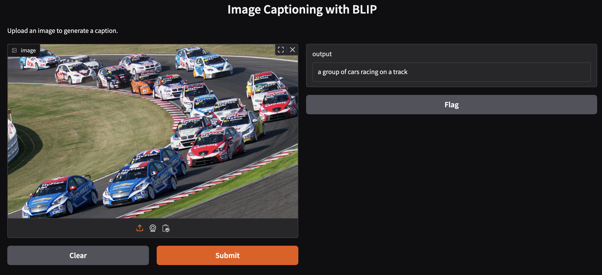

# Image Captioning with BLIP

## Overview

This project is a comprehensive application leveraging the **BLIP (Bootstrapped Language-Image Pretraining)** model to generate captions for images. It includes multiple Python scripts for different functionalities and utilizes the Gradio library for web-based interaction.

## Features

- **Image Upload:** Users can upload an image to the application.
- **Caption Generation:** Automatically generates descriptive captions for images using the BLIP model.
- **Gradio Interfaces:** User-friendly web interfaces built with Gradio for various use cases.
- **Local and URL Image Processing:** Supports captioning for both locally uploaded images and images accessible via URLs.

## Screenshot



## Prerequisites

Before running the scripts, ensure you have the following installed:

1. **Python** (version 3.7 or higher)
2. Required Python libraries:
   - `transformers`
   - `gradio`
   - `Pillow` (for handling images)

You can install these dependencies using pip:

```bash
pip install transformers gradio Pillow
```

## File Descriptions

### **Readme.md**

This file contains documentation for the project, including an overview, features, file descriptions, and instructions on how to run the scripts.

### **blip-answerQuestionAboutImage.py**

- Implements a functionality where users can ask specific questions about an uploaded image.
- Uses BLIP’s question-answering capabilities to analyze and respond to image-related queries.

### **blip-automated_local_image_captioning.py**

- Automates caption generation for a folder of local images.
- Processes multiple images in batch mode and outputs captions for each image.

### **blip-automated_url_captioning.py**

- Accepts a website url and generates captions for every image in that website.
- Suitable for scenarios where there are multiple images on a website which need automated captioning.

### **blip-imageCaptioning.py**

- The core script for basic image captioning.
- Allows users to upload a single image and get a caption generated using the BLIP model.

### **gradio-helloworld.py**

- A simple demonstration of the Gradio library.
- Provides a basic web interface to understand Gradio’s functionality before integrating it with the BLIP model.

### **gradio-imageCaptioning.py**

- A Gradio-based web interface for image captioning.
- Allows users to upload an image through the web interface and view the generated caption in real-time.

### **gradio-urlImageCaptioning.py**

- Extends the Gradio interface to support captioning for images provided via URL.
- Allows users to input a website URL and get the caption generated through the interface.

### **images/**

- A folder containing assets used in the project.
- Includes images for testing and documentation purposes (e.g., `readme.png`).

## How It Works

1. The scripts utilize the **BLIP model** for image captioning, loading the `Salesforce/blip-image-captioning-base` model and processor from the Hugging Face Transformers library.
2. Depending on the script, users can:
   - Upload local images.
   - Provide website URL.
   - Ask questions about uploaded images.
3. Captions or answers are generated using the BLIP model and displayed via the console or a Gradio interface.

## How to Run

### Running Individual Scripts

1. **Basic Image Captioning:**

   ```bash
   python blip-imageCaptioning.py
   ```

2. **Gradio Interface for Image Captioning:**

   ```bash
   python gradio-imageCaptioning.py
   ```

3. **Automated Local Image Captioning:**

   ```bash
   python blip-automated_local_image_captioning.py
   ```

4. **Automated URL Captioning:**

   ```bash
   python blip-automated_url_captioning.py
   ```

5. **Question Answering About Images:**

   ```bash
   python blip-answerQuestionAboutImage.py
   ```

### Using Gradio Interfaces

- For scripts using Gradio, a local server will start, and a link (e.g., `http://127.0.0.1:7860`) will be displayed.
- Open the link in your browser to access the interface.

## Example Usage

1. **Upload an Image:** Drag and drop an image or provide a URL (depending on the script).
2. **View the Result:** The application will process the input and display either a descriptive caption or an answer to a query.

## Learning Experience

This project highlights the integration of **BLIP** for image captioning with **Gradio** for creating interactive web interfaces. The various scripts demonstrate flexibility and modularity in handling different image captioning tasks.

## Future Improvements

- Add functionality to save generated captions to files.
- Extend support for multilingual captions.
- Implement a feature for real-time video frame captioning.
- Enhance the Gradio interface with additional customization options.

---

Feel free to explore the application and provide feedback! 😊
